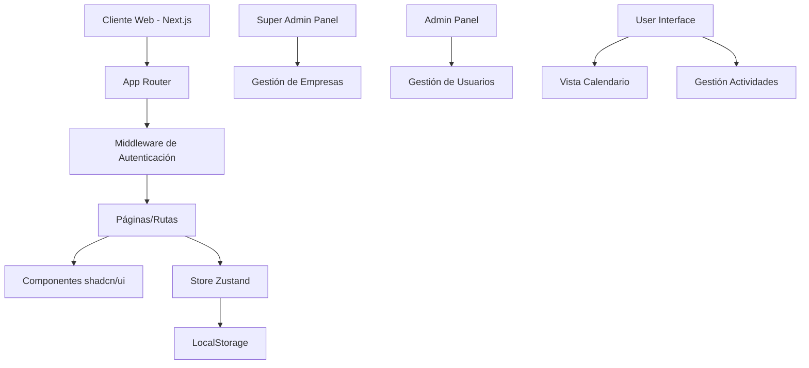

# Documento de Diseño - Plataforma SaaS de Gestión de Actividades

## Visión General

La plataforma será una aplicación web SaaS multi-tenant desarrollada con Next.js 14+ que permite a múltiples empresas gestionar actividades de sus empleados. El sistema implementará un modelo de roles jerárquico con super administrador, administradores de empresa, operadores y usuarios finales, con una interfaz principal basada en calendario.

## Arquitectura

### Arquitectura de Alto Nivel



### Stack Tecnológico

- **Frontend**: Next.js 14+ con App Router
- **UI Components**: shadcn/ui + Tailwind CSS
- **State Management**: Zustand
- **Persistencia**: LocalStorage (desarrollo)
- **Calendario**: React Big Calendar o similar
- **Formularios**: React Hook Form + Zod
- **Autenticación**: NextAuth.js (preparado para futuro)

## Componentes y Interfaces

### 1. Estructura de Datos

```typescript
// Tipos principales
interface User {
  id: string;
  email: string;
  name: string;
  role: 'super_admin' | 'company_admin' | 'operator' | 'user';
  companyId?: string;
  createdAt: Date;
  isActive: boolean;
}

interface Company {
  id: string;
  name: string;
  domain: string;
  settings: CompanySettings;
  createdAt: Date;
  isActive: boolean;
}

interface Activity {
  id: string;
  title: string;
  description?: string;
  startDate: Date;
  endDate: Date;
  userId: string;
  companyId: string;
  createdAt: Date;
  updatedAt: Date;
}

interface CompanySettings {
  timezone: string;
  workingHours: {
    start: string;
    end: string;
  };
  allowUserSelfRegistration: boolean;
}
```

### 2. Store de Estado (Zustand)

```typescript
// Stores principales
interface AuthStore {
  currentUser: User | null;
  currentCompany: Company | null;
  login: (email: string, password: string) => Promise<void>;
  logout: () => void;
  switchCompany: (companyId: string) => void;
}

interface CompanyStore {
  companies: Company[];
  selectedCompany: Company | null;
  createCompany: (data: CreateCompanyData) => void;
  updateCompany: (id: string, data: UpdateCompanyData) => void;
  deleteCompany: (id: string) => void;
}

interface UserStore {
  users: User[];
  createUser: (data: CreateUserData) => void;
  updateUser: (id: string, data: UpdateUserData) => void;
  deleteUser: (id: string) => void;
  getUsersByCompany: (companyId: string) => User[];
}

interface ActivityStore {
  activities: Activity[];
  createActivity: (data: CreateActivityData) => void;
  updateActivity: (id: string, data: UpdateActivityData) => void;
  deleteActivity: (id: string) => void;
  getActivitiesByUser: (userId: string) => Activity[];
  getActivitiesByCompany: (companyId: string) => Activity[];
  getActivitiesByDateRange: (start: Date, end: Date) => Activity[];
}
```

### 3. Estructura de Rutas

```
/
├── /login                    # Página de login
├── /super-admin             # Panel super administrador
│   ├── /companies           # Gestión de empresas
│   └── /settings            # Configuración global
├── /admin                   # Panel administrador empresa
│   ├── /users               # Gestión de usuarios
│   ├── /reports             # Reportes
│   └── /settings            # Configuración empresa
├── /dashboard               # Dashboard principal
├── /calendar                # Vista calendario (principal)
├── /activities              # Lista de actividades
│   ├── /new                 # Nueva actividad
│   └── /[id]                # Editar actividad
└── /profile                 # Perfil usuario
```

### 4. Componentes Principales

#### Layout Components
- `RootLayout`: Layout principal con navegación
- `AuthLayout`: Layout para páginas de autenticación
- `DashboardLayout`: Layout con sidebar para usuarios autenticados

#### Feature Components
- `CalendarView`: Componente principal del calendario
- `ActivityForm`: Formulario para crear/editar actividades
- `UserManagement`: Gestión de usuarios (admin)
- `CompanyManagement`: Gestión de empresas (super admin)
- `ActivityList`: Lista de actividades
- `ReportsPanel`: Panel de reportes

#### UI Components (shadcn/ui)
- Button, Input, Select, Dialog, Table
- Calendar, DatePicker, TimePicker
- Card, Badge, Avatar
- Form, Label, Textarea

## Modelos de Datos

### Esquema de LocalStorage

```typescript
// Estructura en localStorage
interface LocalStorageSchema {
  'saas-platform': {
    users: User[];
    companies: Company[];
    activities: Activity[];
    currentSession: {
      userId: string;
      companyId?: string;
      token: string;
    } | null;
  };
}
```

### Relaciones de Datos

- Un **Super Admin** puede gestionar múltiples **Companies**
- Una **Company** tiene múltiples **Users**
- Un **User** pertenece a una **Company** (excepto Super Admin)
- Una **Activity** pertenece a un **User** y una **Company**
- Los **Operators** pueden ver actividades de su **Company**
- Los **Company Admins** pueden gestionar usuarios de su **Company**

## Manejo de Errores

### Estrategia de Errores

1. **Validación de Formularios**: Zod schemas con mensajes descriptivos
2. **Errores de Estado**: Toast notifications con shadcn/ui
3. **Errores de Autenticación**: Redirección a login con mensaje
4. **Errores de Permisos**: Páginas 403 con mensaje explicativo
5. **Errores de Red**: Retry automático con feedback visual

### Componentes de Error

```typescript
// Error Boundaries
- GlobalErrorBoundary: Captura errores no manejados
- FormErrorBoundary: Errores específicos de formularios
- DataErrorBoundary: Errores de carga de datos
```

## Estrategia de Testing

### Tipos de Tests

1. **Unit Tests**: Funciones utilitarias y stores
2. **Component Tests**: Componentes individuales con React Testing Library
3. **Integration Tests**: Flujos completos de usuario
4. **E2E Tests**: Cypress para flujos críticos

### Casos de Test Prioritarios

- Autenticación y autorización
- Creación y edición de actividades
- Vista de calendario
- Gestión de usuarios (admin)
- Multi-tenancy (aislamiento de datos)

## Consideraciones de Seguridad

### Implementación de Seguridad

1. **Autenticación**: NextAuth.js con providers locales
2. **Autorización**: Middleware de rutas basado en roles
3. **Validación**: Zod schemas en cliente y servidor
4. **Sanitización**: Escape de HTML en contenido dinámico
5. **CSRF Protection**: Tokens CSRF en formularios

### Aislamiento Multi-Tenant

```typescript
// Middleware de tenant
export function tenantMiddleware(request: NextRequest) {
  const user = getCurrentUser(request);
  if (user.role !== 'super_admin' && !user.companyId) {
    return redirect('/unauthorized');
  }
  // Filtrar datos por companyId en todas las operaciones
}
```

## Consideraciones de Performance

### Optimizaciones

1. **Code Splitting**: Lazy loading de rutas no críticas
2. **Memoización**: React.memo en componentes pesados
3. **Virtual Scrolling**: Para listas grandes de actividades
4. **Caching**: SWR/React Query para datos frecuentes
5. **Bundle Optimization**: Tree shaking y análisis de bundle

### Métricas de Performance

- First Contentful Paint < 1.5s
- Largest Contentful Paint < 2.5s
- Cumulative Layout Shift < 0.1
- First Input Delay < 100ms

## Plan de Migración Futura

### De LocalStorage a Base de Datos

1. **Fase 1**: Abstraer capa de datos con interfaces
2. **Fase 2**: Implementar API routes en Next.js
3. **Fase 3**: Integrar base de datos (PostgreSQL/MongoDB)
4. **Fase 4**: Migrar autenticación a provider externo
5. **Fase 5**: Implementar cache y optimizaciones de BD